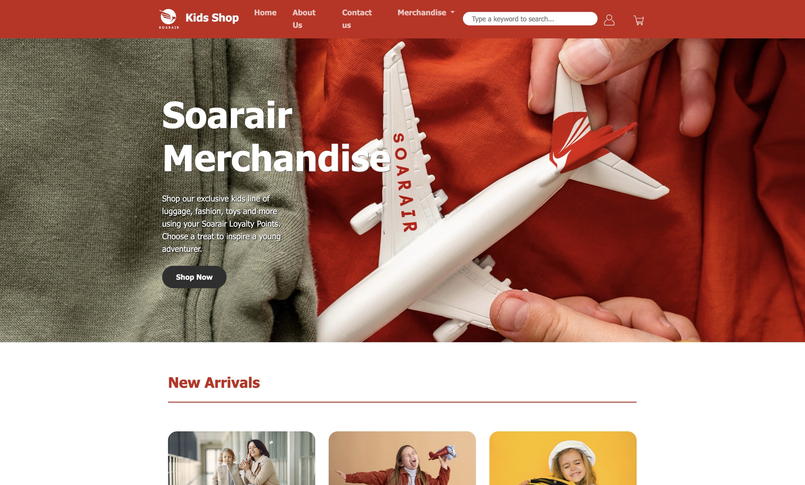
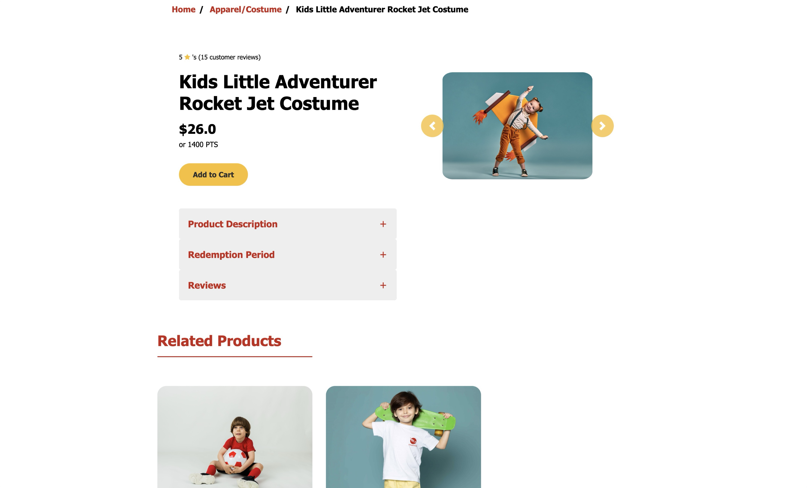
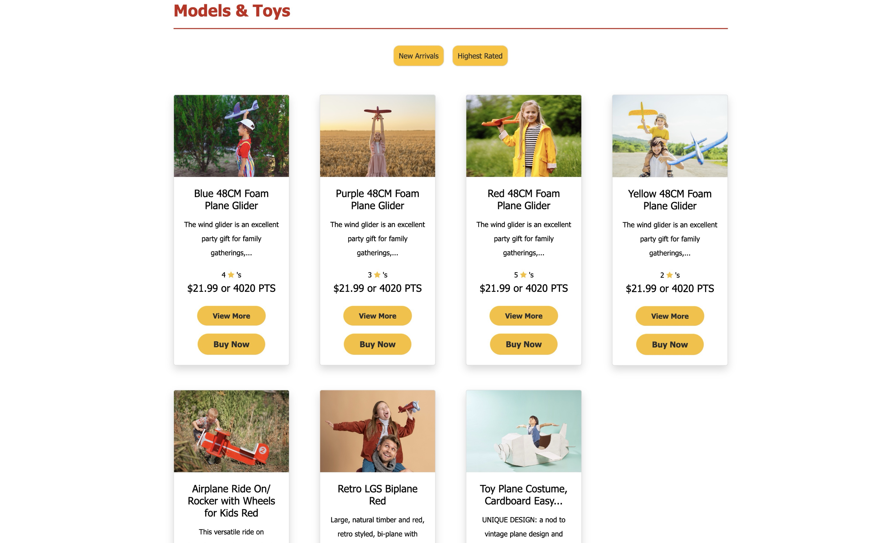
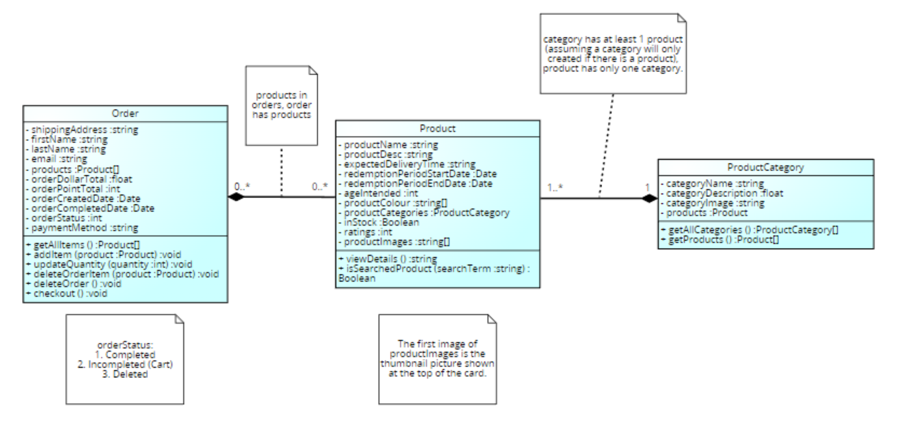
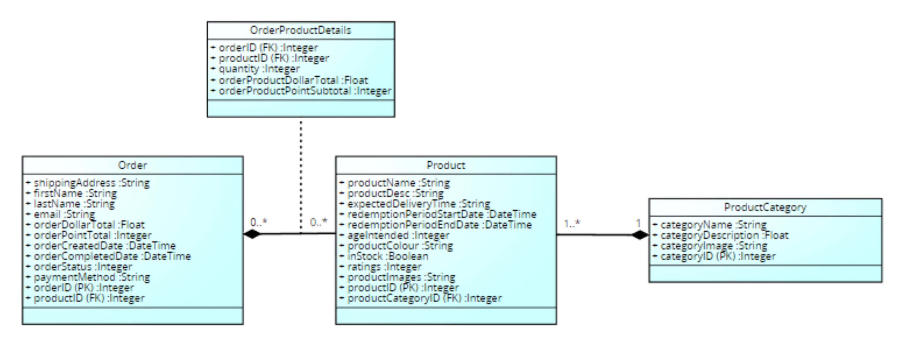

# SoarAir Merchanise Shopping Web Application

A work by Pranshu & Tiffany, 2022

##  About this Project

This project is based on a simulated airline brand named ***SoarAir*** to create a conceptual kid-specialised loyalty online store using Flask that implements the following technologies:
- HTML & Bootstrap (version 4), CSS
- Flask Templates
- Flask WTForms
- Flask SQLAlchemy

## App Demo 🚀

Youtube: https://youtu.be/H2fa2WJ8_k0

**Landing Page:**



**Product Detail:**



**Product Category Catalogue:**



## Project Deliverables
1. Customer landing page to search/ filter for products e.g. by category, with a subpage to display specific categories.
2. Item detail page (to view additional item details) with ability to add to shopping basket.
3. Shopping Basket showing appropriate information about the added products and at the minimum the ability to view/delete items.
4. Checkout page (enter details, order completion)
5. Create a database with at least 3 tables: products, orders, orderDetails

## Takeaways & Reflections
- Learnt how to design a web application using the Model-view-controller (MVC) architecture pattern
- Learnt some of the foundations of HTML and CSS and the Bootstrap framework to create responsive websites
- Demonstrated skills at developing a prototype e-commerce web application
- Demonstrated approaches for producing Web application design in support of requirements, at a sufficient level of detail for use in the software development process.
- Undertook tasks to specify Web forms and databases, using frameworks, which will be used when developing the program code of Web applications.


## Reflections

> "From the onset of this group project, Tiffany & I split the workload equally amongst ourselves, which led to an efficient & smooth work process throughout while also simultaneously managing commitments outside of this project. During our work on the project, Tiffany spearheaded a consistent design formulation for our website to great results. She also has a knack for debugging, manual testing and quick problem-solving. Moreover, her creative ideas and organised work structure significantly contributed to this project's timely and successful completion."   ***- Pranshu***

> "Overall, Pranshu and I worked quite effectively together on this project. Pranshu has contributed significantly to the execution of the control component and has demonstrated a desire to offer assistance and guidance to me to help me succeed in my part, demonstrating his responsible and supportive involvement in this project. Pranshu is fully cognizant of our objectives. The calibre of his work, his capacity for task coordination, and his aptitude for solving issues have all proved his commitment and capability to accomplish those goals." ***- Tiffany***

## Requirements

### 1. View products / services
- Your ecommerce store should list the set of products or services that are currently available for sale. 
- The products/services can be grouped into different categories. 
- A user should be able to view all products/services belonging to a group. 
- In an ecommerce store for books, a buyer should be able to find all `fiction’ books by choosing the group.
- A user should be able to select a product/service and view the details of it. The details should be determined based on what the product/service is. For a book, it would be the author, ISBN, category and so on.

### 2. Order products / services 
- A user who wants to buy the product/service, should be able to add the product to a basket.
- A user should be able to view the contents of their basket at any time, remove items.
- A user should be able to complete the order by providing details such as their name and shipping address.


## App Concepts

As a subsidiary eCommerce brand of the fictional airline ***Soarair***, ***Soarair Kids*** specialises in selling a range of kids' travel and aviation-related merchandise including:

- Kids Travel Accessories
- Kids Bags/ Luggage
- Models and Toys
- Flight Comforts
- Apparel/ Costume
- Back-to-school collection

An additional equivalent points are attached to each items beside the monetary pricing found on the landing page as well as product details page, just to illustrate the concept of an airline loyalty store. Although demonstrated on the product details, payment will not be implemented in this design as it is assumed that a user is a visitor without an associated account in the first place. On the landing page, the user can navigate through to the middle of the page or the dropdown categories menu on the navigation bar to visit any categories for their shopping.

## User Stories

| User Story    | Title    | Story    | Acceptance Criteria     |
|--------------|--------------|--------------|--------------|
| 1| View products by category | "As a user, I want to be able to view all of the products by category so that I can focus exclusively on the products that interest me and save time from searching through all items." |- Categories should be listed on the landing page and navigation bar.<br> - Search bar on the landing page that leads to a page of items belonging to a category. <br> - On each item page, a breadcrumb leads the user back to the category they were shopping in.|
| 2 | Search item by keyword |“As a user, I'd prefer the option to search for something because it saves me time from having to browse through all the categories and things that I am not looking for.”|- All pages will have a search field added to the navigation bar that returns products that contain the query terms in the title, description, or category of the item. <br> - Returns an error message if no results are found.|
| 3 | Select and View details of a product |"As a user, I want to see product details for a specific product so that I can ensure I understand all of the specifications before purchasing, allowing me to find a product that is suitable for my child’s age.”| - The product price (and equivalent loyalty points), colour, product images, product information and features, return and refund policy, ratings and reviews have to be displayed for user’s viewing. <br> - If no stock is available, the product should be marked "Out of Stock." <br> - The discounted price is displayed for items on sale. <br> - The age range the product is intended for should be visible.|
| 4 | Edit shopping basket |“As a user, I would like to be able to add items to the shopping cart to purchase with other items as well as edit the quantity or remove items I don’t want to include in my final purchase if I need to change my mind.”|- Allow user to add product of a specified quantity to the shopping cart on the product detail page. <br> - Single product can be removed from the shopping cart. <br> - Product quantity can be adjusted in the shopping cart. <br> - Shopping cart can be removed in its entirety, i.e. removing all items at once. <br> - Send a prompt to the screen when items are successfully removed.|
| 5 | View shopping basket content at any time |“As a user, I want the shopping cart status to be saved for later review so that I can continue shopping at any point.”|Shopping cart navigation to be provided on the navigation bar that leads user to the most recent shopping basket|
| 6 | Complete the order with personal details |"As a user, I'd like to be able to check out all items I have added to my shopping cart by providing my contact details so that I can enjoy a simple, user friendly online shopping experience with only a few clicks."|- Check out page to display the list of items, subtotal by product, and the total indicative price. <br> - Requests name, shipping address, phone number from the user at check out. <br> - Send a prompt to the user that the order has been successfully placed.|

## Conceptual Model

All users are assumed to purchase as visitors to simplify the conceptual model to one that only meets the user's minimal requirements. As a result, the user class can be removed, and customer details such as shipping address and name become attributes of an order provided by the customer upon order completion. A product instance has associated star ratings, as shown on the landing page and details page, as well as customer reviews, which, if implemented, should have their own class called `Reviews` and are stored in the product class as a list of reviews. However, this has been ignored as it is deemed out of the scope of the user requirements, and the number of ratings along with other attributes such as redemption dates to be displayed on the page are only served as additional information to the products to bring the design into a realistic fruition. Additionally, it is assumed in this model that a product can only belong to one and only one category.

Thoughts have been made over whether to include shopping cart as a separate class to store the temporary state of items. However, since both the cart and order contain a list of products and eventually a cart will turn into an order if proceeded to check out. Due to the similarities of functions, Order will act as a multifunctional class to serve as a shopping cart (i.e., an incomplete order) and a completed order with customer details with the order status differentiating if the order has been completed. The removal of shopping cart also removes the need of having an additional cartDetails table that instantiates the many-to-many relationship between cart and items.

 

## Database Design

The data model features an additional table - `orderDetails` table to establish a many-to-many relationship between the classes. Connections can now be made between specific orders and products and vice versa. Quantity and item total in points and dollar values are also stored in the same table to allow calculation of order sum at checkout, as a customer may order multiple items for one particular product.



## Project Structure

```
soarair/
├── run.py                      # Application entry point
├── instance/                   # Instance folder (contains soarair.sqlite database)
├── soarair/                    # Main package directory
│   ├── __init__.py             # Package initialization and app creation
│   ├── admin.py                # Admin blueprint (includes dbseed route)
│   ├── forms.py                # Form definitions
│   ├── models.py               # Database models
│   ├── views.py                # Main views/routes
│   ├── static/                 # Static files
│   │   ├── css/                # CSS style guides
│   │   └── images/             # Image files
│   │       ├── Accessories/    # Product category images
│   │       ├── Apparel/        # Product category images
│   │       ├── BackToSchool/   # Product category images
│   │       ├── FlightComforts/ # Product category images
│   │       ├── Luggage/        # Product category images
│   │       └── ToyPlanes/      # Product category images
│   │       └── Icons/          # Icon Images
│   └── templates/              # HTML templates
│       ├── 404.html            # Error page
│       ├── 500.html            # Error page
│       ├── base.html           # Base template
│       ├── checkout.html       # Checkout page
│       ├── index.html          # Home page
│       ├── order.html          # Shopping cart page
│       ├── productDetails.html # Product details page
│       ├── shop.html           # Shop page
│       ├── shopsearch.html     # Search results page
│       └── thankyou.html       # Order confirmation page
├── img/                        # images linked in this markdown files
└── prototype                   # phase 1 frontend prototypes without backend implementation
```

## Installation and Execution Guide

### Prerequisites
- Python 3.8 or higher

### Step 1: Install SQLite3
- Refer to installation guide: https://www.sqlite.org/download.html

### Step 2: Install Required Dependencies in Virtual Environment

```bash
pip install flask flask-sqlalchemy flask-bootstrap flask-wtf email_validator
```

### Step 3: Initialize the Database

Run the `create_db.py` in the project root with the following content:

```python
from soarair import create_app, db

app = create_app()
with app.app_context():
    db.create_all()
    print("Database tables created successfully!")
```

Run the script to create the database tables:
```bash
python init_db.py
```

### Step 4: Seed the Database (Using the built-in `/admin` route)

Start the application:
```bash
python run.py
```

Visit the following URL in your browser:
```
http://127.0.0.1:5000/admin/dbseed/
```

If the seeding process has worked then you should be greeted by `DATA LOADED` and now see `categories`, `orderdetails`, `orders` and `products` tables in the SQLite DB browser app.

### Step 5: Run the Application

```bash
python run.py
```

Access the application at:
```
http://127.0.0.1:5000/
```
